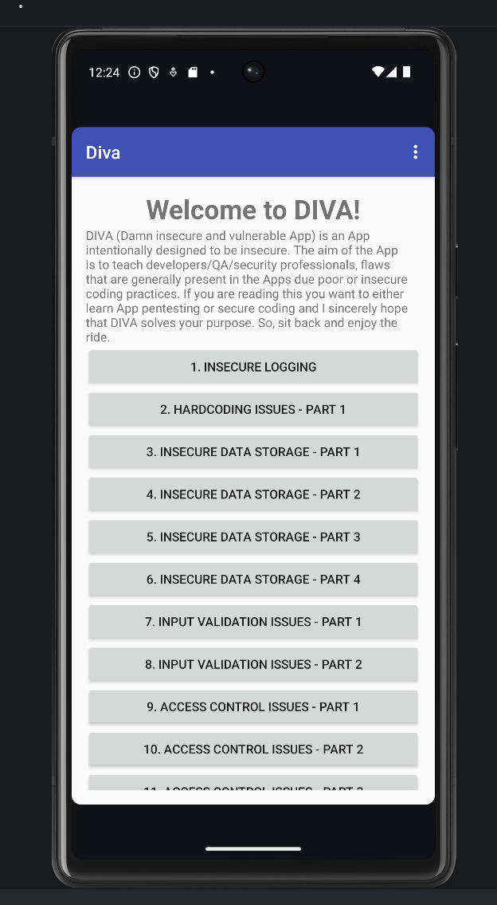
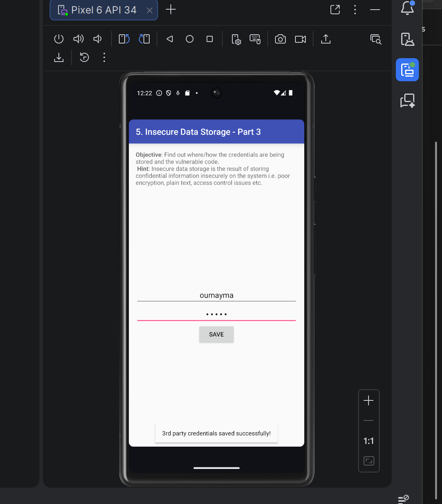
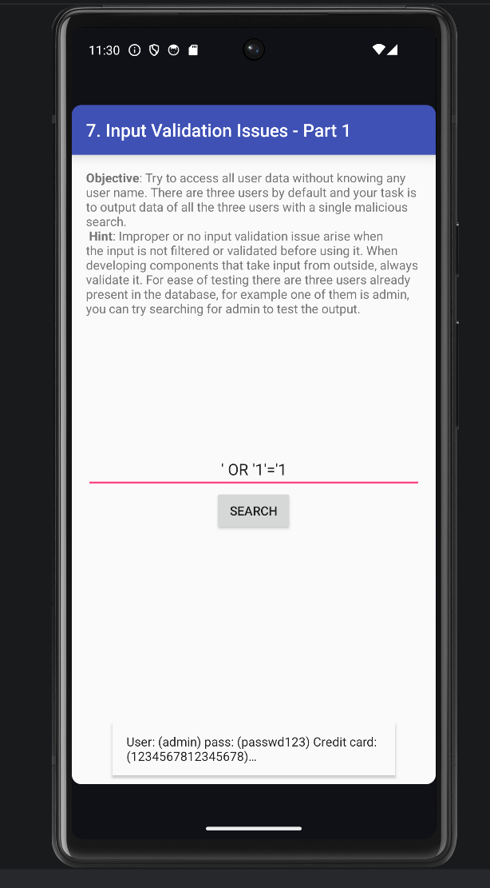
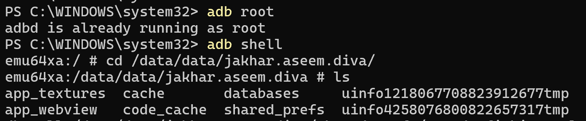

# 📱 LAB-2 - Audit de Sécurité Android : Rooting & Environnement

## 🛡️ Introduction
Ce projet est un audit de sécurité méthodologique d'un environnement Android, réalisé dans le cadre d'un cursus de Cybersécurité . Il s'appuie sur les standards de l'industrie, notamment l'**OWASP MASVS** (Mobile App Security Verification Standard) et l'**OWASP MASTG** (Mobile App Security Testing Guide).

L'objectif principal est de comprendre en profondeur les mécanismes de sécurité d'Android, en particulier le processus de **Rooting**, la **Chaîne de Confiance** (Verified Boot), et la mise en place d'un environnement d'analyse de vulnérabilités contrôlé.

**Remarque :** Toutes les étapes ont été réalisées sur un **Android Virtual Device (AVD)** créé dans **Android Studio**, et non sur un appareil physique.  
Cela garantit un environnement sécurisé pour tester des actions telles que l’élévation de privilèges (root) et la modification de l’intégrité système, sans risquer d’endommager un téléphone réel.

> [!WARNING]
> **DISCLAIMER** : Ce laboratoire est réalisé dans un but strictement **pédagogique et éthique**, au sein d'un environnement cloisonné (Lab). Les techniques présentées ici ne doivent être utilisées que sur des systèmes dont vous êtes propriétaire ou pour lesquels vous disposez d'une autorisation explicite.

---

## 🛠️ Outils Utilisés

Ce laboratoire repose sur les outils standards de l'écosystème Android et du Pentesting Mobile :

*   **Android Studio** (Gestionnaire AVD)
*   **ADB** (Android Debug Bridge)
*   **AVD** (émulateur Android)
*   **DIVA**


---

## 📋 Étapes du Laboratoire

### Étape 1 — Rooter l'AVD
L’objectif de cette étape est de comprendre comment fonctionne l’accès root sur un appareil Android et d’observer l’impact sur l’intégrité du système. Pour cela, j’ai utilisé un Android Virtual Device (AVD), qui est un émulateur Android, afin de tester ces concepts dans un environnement sécurisé.

#### 1. Vérification de l’AVD

Le terminal a affiché l’AVD actif comme emulator-5554 device, ce qui confirme que l’émulateur fonctionne correctement et que ADB peut communiquer avec lui.
#### 2. Activation du mode root

Cela signifie que le serveur ADB fonctionne désormais avec les privilèges administrateur, donnant un accès complet au système Android sur l’émulateur.
#### 3. Vérification des privilèges root

Ce résultat confirme que j’ai bien les privilèges root dans le shell ADB (uid=0). Cela correspond à un accès administrateur complet sur l’AVD.
#### 4. Vérification de l’intégrité système

Cela montre que dm-verity est actif, ce qui protège l’intégrité du système de fichiers, et que l’AVD ne simule pas complètement le mécanisme Android Verified Boot (AVB). Le root via ADB est actif, mais le bootloader est verrouillé et /system ne peut pas être modifié.
#### 5. Test du binaire su

Cela indique que le binaire su n’est pas installé sur l’AVD. Mon accès root est fourni uniquement via ADB (adb root) et non via une solution comme Magisk.
#### 6. Journalisation

Le fichier logcat_root_check.txt contient les derniers messages du système et constitue une documentation de l’état du root et de la sécurité de l’AVD.
### Étape 2 — Fiche périmètre

**Application :** Application Android test (version utilisée dans l’AVD).  
**Support :** Android Virtual Device (AVD) via Android Studio.  
**Objectif :** Comprendre le rooting Android et analyser ses impacts sur l’intégrité du système.  
**Données utilisées :** Données fictives uniquement.  
**Environnement réseau :** Réseau local de test (aucune interaction avec un environnement réel).

### Étape 3 — Démarrer un AVD propre
Dans cette étape, j’ai démarré un appareil virtuel (AVD) à l’aide d’Android Studio afin de disposer d’un environnement de test propre et contrôlé.

L’émulateur utilisé est basé sur Android 14 (API 34). Aucun compte personnel n’a été configuré et aucune application résiduelle n’était présente afin de garantir un environnement sain pour les tests de sécurité.

La connexion ADB a été vérifiée avec la commande suivante :
*   **Vérification :** `adb devices` doit lister l'appareil.


### Étape 4 — Installer et lancer l'app de test
Dans cette étape, nous avons installé l'application **DIVA (Damn Insecure and Vulnerable App)** sur un émulateur Android pour commencer nos tests de sécurité.
L’APK a été téléchargé depuis le dépôt GitHub et installé sur l’émulateur via ADB :


L’écran PowerShell avec les commandes pm list packages et dumpsys package affichant le package et la version.

L’application DIVA fonctionne correctement sur l’émulateur.


### Étape 5 — Définir 3 scénarios simples

Dans cette étape, nous avons défini trois scénarios simples pour l’application **DIVA**, afin de tester les fonctionnalités principales de manière répétable et documentée. Chaque scénario est accompagné de captures d’écran pour la vérification.

---

### Scénario 1 : Ouvrir l’écran d’accueil

**Objectif :** Vérifier que DIVA se lance correctement et que l’écran principal est fonctionnel.

**explication :**  
Ce test de fumée (smoke test) garantit que l'environnement d'exécution (AVD) et l'application sont correctement configurés. Si l'application crashe au démarrage, aucun autre test de sécurité ne peut être effectué fiable.

**Étapes :**
1. Ouvrir l’émulateur Android.  
2. Cliquer sur l’icône **DIVA** pour lancer l’application.  
3. Observer l’écran d’accueil et vérifier que les menus et boutons principaux sont visibles et cliquables.

**Résultat attendu :**
- L’écran principal s’affiche correctement.
- Aucun crash ou message d’erreur.

**Captures d’écran :**


---

### Scénario 2 : Naviguer dans un module principal (Login)

**Objectif :** Vérifier que le module Login fonctionne correctement.

**explication :**  
Le mécanisme d'authentification est une surface d'attaque critique. Avant de tenter de le contourner ou de l'attaquer, il est essentiel de comprendre son fonctionnement nominal (happy path).

**Étapes :**
1. Depuis l’écran d’accueil, cliquer sur le bouton **Login**.  
2. Remplir les champs avec des données fixes :  
   - `username` : test  
   - `password` : test  
3. Cliquer sur **Submit / Login**.  

**Résultat attendu :**
- La page suivante s’affiche correctement ou un message de succès/erreur apparaît.  
- Aucun crash.

**Captures d’écran :**


---

### Scénario 3 : Test d’injection SQL dans le module Login

**Objectif :**  
Tester la présence d’une vulnérabilité de type SQL Injection dans le module Login de l’application DIVA.

**explication :**  
L'injection SQL est une vulnérabilité classique où l'attaquant manipule la requête SQL backend via les entrées utilisateur. Ici, nous tentons de contourner l'authentification en injectant une condition toujours vraie (`' OR '1'='1`).

### Étapes réalisées :

1. Ouvrir l’application DIVA.
2. Cliquer sur le module **Login**.
3. Dans le champ `username`, saisir exactement : `' OR '1'='1`
4. Dans le champ `password`, saisir : `n'importe quoi`
5. Cliquer sur **Login / Submit**.

### Résultat observé :

- L’application affiche des informations sensibles stockées dans la base de données.
- Les données affichées incluent souvent la liste des utilisateurs enregistrés ou un message confirmant l'accès administrateur, prouvant que la requête SQL a été altérée avec succès.

**Captures d’écran :**


### Étape 6 : Résumé de la sécurité Android

La sécurité Android repose sur plusieurs couches de protection.  
Le **sandboxing** isole chaque application pour qu’elle ne puisse pas accéder aux données des autres apps.  
Le **modèle de permissions** oblige les applications à demander l’autorisation avant d’accéder aux ressources sensibles (caméra, contacts, stockage).  
L’**intégrité du système** protège Android contre les modifications non autorisées.  
Ces mécanismes fonctionnent ensemble pour limiter les risques même si une application est vulnérable.  
Le rooting peut contourner certaines de ces protections en donnant un accès plus profond au système.

### Étape 7 : Verified Boot

### Idée générale

Verified Boot est un mécanisme de sécurité qui vérifie l’intégrité du système Android au moment du démarrage.  
Son objectif principal est de garantir que le système qui démarre est bien celui prévu par le fabricant, sans modifications malveillantes.

On peut comparer Verified Boot à un système d’alarme qui vérifie si quelqu’un a modifié les serrures ou les portes de la maison.  
Si une modification est détectée, le système peut alerter l’utilisateur ou refuser de démarrer.

---

### Chain of Trust (Chaîne de confiance)

La *chain of trust* est une série de vérifications où chaque composant vérifie l’authenticité du suivant avant de lui faire confiance.  
C’est comme une chaîne de gardiens où chacun vérifie l’identité du suivant avant de le laisser passer.

---

### Pourquoi l’intégrité au démarrage est critique ?

Si le processus de démarrage est compromis, toutes les protections de sécurité chargées ensuite peuvent être contournées.  
C’est comme une forteresse dont la porte principale serait déjà ouverte : toutes les défenses internes deviennent inutiles.

### Étape 8 : AVB (Android Verified Boot 2.0)

AVB (Android Verified Boot 2.0) est une version moderne de Verified Boot qui vérifie l’intégrité cryptographique du système au démarrage pour empêcher toute modification non autorisée.
Il ajoute une vérification d’intégrité plus flexible (basée sur des signatures et métadonnées) ainsi qu’une protection anti-rollback.
La protection anti-rollback empêche l’installation d’anciennes versions vulnérables du système, comme empêcher quelqu’un de remplacer une serrure sécurisée par une ancienne plus facile à forcer.

### Étape 9 : Définir le rooting

Le rooting consiste à obtenir les privilèges super-utilisateur (root) sur Android, ce qui donne un contrôle total sur le système.  
Cela modifie les mécanismes de protection et le modèle de confiance du système, notamment Verified Boot et l’isolation standard.  
En laboratoire, le root est utile pour observer des comportements avancés et analyser la sécurité en profondeur.  
Cependant, il est risqué : il nécessite un environnement isolé, une bonne traçabilité des actions et un reset après les tests.

**Analogie :** Le rooting, c’est comme avoir un passe-partout pour toutes les portes d’un bâtiment. Très utile pour la maintenance, mais dangereux s’il est mal utilisé.

**Contexte historique :** Le terme root vient d’UNIX, où l’administrateur s’appelle "root". Android étant basé sur Linux, obtenir le root signifie devenir cet administrateur tout-puissant.

### Étape 10 : Intérêt du laboratoire

En laboratoire autorisé uniquement, un environnement privilégié peut aider à :

*   Observer des artefacts système normalement inaccessibles
*   Analyser les comportements runtime de l’application à bas niveau
*   Tester la robustesse du stockage face à un attaquant privilégié

Par exemple, avec les privilèges root, il est possible d’examiner comment une application stocke ses données sensibles. Cela permet de vérifier si elle se repose uniquement sur la protection du système (mauvaise pratique) ou si elle implémente son propre chiffrement (bonne pratique).

### Étape 11 : Identification des risques

Dans un laboratoire de sécurité mobile, l’identification des risques est essentielle afin de garantir des tests fiables, reproductibles et conformes aux bonnes pratiques de cybersécurité.

**Risques identifiés**

*   **Intégrité non garantie** → Un système modifié peut produire des conclusions biaisées sur le niveau réel de sécurité d’une application.
*   **Surface d’attaque accrue hors laboratoire** → Si l’appareil sort du cadre contrôlé, il peut être exposé à des menaces externes supplémentaires.
*   **Exposition de données sensibles** → La présence de données réelles sur un appareil compromis peut entraîner une violation de confidentialité.
*   **Instabilité du système** → Un environnement rooté ou modifié peut provoquer des comportements imprévisibles, rendant les tests non reproductibles.
*   **Mélange comptes personnels et comptes de test** → L’utilisation d’identifiants personnels peut conduire à une fuite involontaire d’informations sensibles.
*   **Mauvais nettoyage en fin de séance** → L’absence de suppression des données de test peut entraîner une persistance d’informations sensibles.
*   **Réseau non isolé** → Un laboratoire connecté au réseau principal peut impacter involontairement des systèmes externes.
*   **Traçabilité insuffisante** → L’absence de journalisation ou de documentation empêche la reproduction ou l’audit des tests réalisés.

### Étape 12 : Mesures défensives mises en place

Afin de garantir un environnement de laboratoire sécurisé et maîtrisé, les mesures suivantes ont été appliquées :

*   **Réseau isolé** → L’environnement de test est séparé du réseau principal afin d’éviter toute communication non contrôlée.
*   **Données fictives uniquement** → Seules des données de test sont utilisées afin d’éliminer tout risque de fuite d’informations réelles.
*   **Device / AVD dédié** → L’émulateur Android est utilisé exclusivement pour les tests de sécurité afin d’éviter tout mélange d’usages.
*   **Snapshots ou wipe après test** → L’environnement est réinitialisé en fin de séance pour ne laisser aucune trace persistante.
*   **Journal de configuration détaillé** → Toutes les configurations et modifications sont documentées afin d’assurer la reproductibilité des tests.
*   **Aucun compte personnel utilisé** → Aucun identifiant personnel n’est configuré sur l’appareil de test afin d’éviter toute exposition involontaire.
*   **Contrôle strict des APK installées** → Seules les applications nécessaires au laboratoire sont installées pour limiter la surface d’attaque.
*   **Horodatage et captures d’écran** → Chaque étape importante est documentée avec date et preuve visuelle afin d’assurer une traçabilité complète.

### Étape 13 : Référence au standard OWASP MASVS

Le OWASP MASVS (Mobile Application Security Verification Standard) est un standard de sécurité qui définit les exigences qu’une application mobile doit respecter pour être considérée comme sécurisée.

**Exigence 1 – STORAGE-1**

Les données sensibles (mots de passe, tokens, clés API, numéros de carte, etc.) doivent être stockées de manière sécurisée en utilisant des mécanismes de chiffrement appropriés.  
L’application ne doit jamais stocker ces informations en clair dans les fichiers locaux, bases SQLite ou SharedPreferences.

**Exigence 2 – NETWORK-1**

Toutes les communications réseau doivent utiliser TLS correctement configuré.  
L’application doit vérifier les certificats du serveur afin d’éviter les attaques de type Man-in-the-Middle (MITM).

### Étape 14 : OWASP MASTG

Guide de test (Comment tester).
*   **Référence :** **MASTG-TEST-0001** (Testing for Root Detection).
*   Méthodologie pour identifier les checks anti-root et les contourner (Hooking via Frida).

**Illustration de données sensibles récupérées :**



### Étape 15 — Commandes de rooting (rappel synthèse)
Commandes ADB essentielles pour gérer l'accès root :
```bash
adb root       # Redémarre adbd en mode root (sur builds userdebug)
adb shell      # Ouvre un shell
su             # Dans le shell, passe en root (nécessite Magisk/SuperSU)
whoami         # Doit retourner 'root'
```

### Étape 16 : Traçabilité – Fiche environnement

**Auteur / Date**

*   **Auteur :** Oumaima Benhilal
*   **Date :** 14/02/2026

**Support**

*   **Device / AVD :** Pixel 6 (API 34, Android Studio)

**Version Android / API**

*   **Android 13, API Level 34**

**Application testée**

*   **Nom :** DIVA
*   **Version :** 1.0

**3 scénarios réalisés**

1.  **Écran d’accueil**
    *   Vérification que l’application s’ouvre correctement et que les boutons principaux sont visibles.
2.  **Module Login simple**
    *   Test de login avec identifiants de test : `username=test`, `password=test`.
3.  **Injection SQL**
    *   Saisie : `username=' OR '1'='1` et `password=test` → récupération de données sensibles simulées.

**Observations factuelles**

*   L’application s’ouvre sans crash.
*   Les scénarios 1 et 2 fonctionnent comme prévu.
*   Injection SQL (scénario 3) montre que DIVA est vulnérable volontairement pour l’apprentissage.
*   Les fichiers de l’application sont accessibles uniquement avec privilèges root.
*   Les logs révèlent certaines informations sensibles lors des tests root.

**Limites**

*   Tests réalisés uniquement sur AVD / device labo, pas sur appareil personnel.
*   Certaines propriétés comme `ro.boot.verifiedbootstate` peuvent être vides sur AVD.
*   Les résultats peuvent différer sur un appareil physique rooté ou non.

### Étape 17 — Remise à zéro AVD
Procédure pour nettoyer l'émulateur après le lab.
*   Dans AVD Manager : Action > **Wipe Data**.
*   Permet de repartir sur une base saine pour le prochain audit.

### Étape 18 — Remise à zéro device labo
(Si appareil physique utilisé)
*   Flasher la **Factory Image** officielle via Fastboot pour supprimer toute trace de modification et reverrouiller le chargeur de démarrage (Bootloader Lock).

### Étape 19 — Livrables
Ce qui doit être rendu à la fin du laboratoire :
1.  Rapport d'audit (PDF).
2.  Preuves de concept (Screenshots, scripts Frida).
3.  Fiche de synthèse des vulnérabilités trouvées.

### Étape 20 — Checklist finale
- [ ] AVD rooté et fonctionnel.
- [ ] Accès ADB root confirmé.
- [ ] Application cible installée.
- [ ] Trafic réseau interceptable.
- [ ] Environnement nettoyé après usage.
