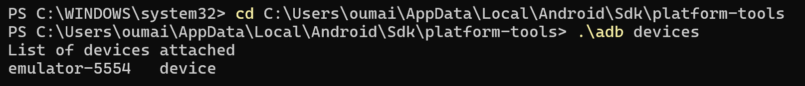
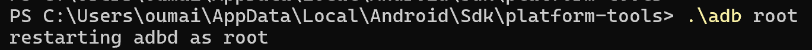
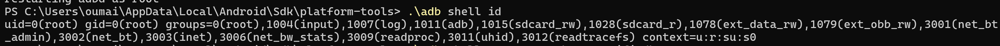
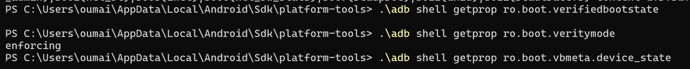
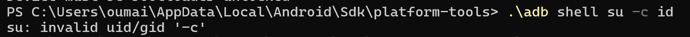
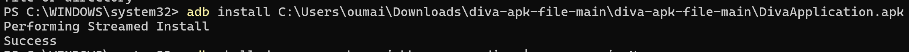
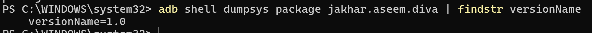
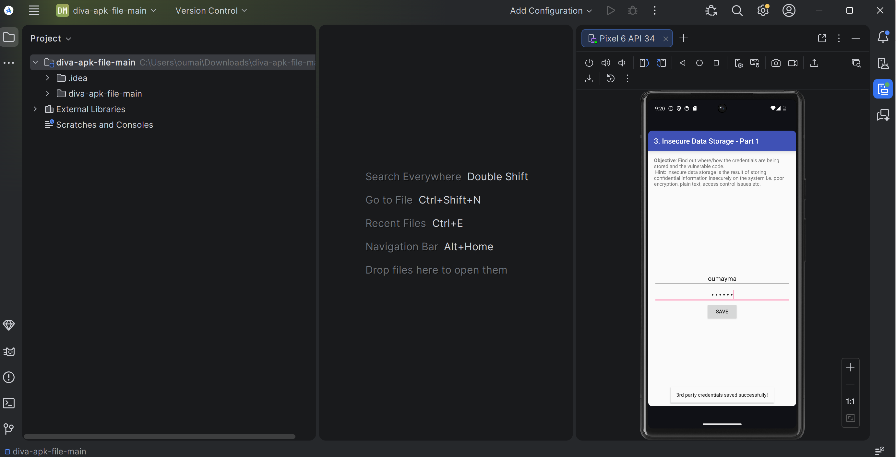

# 📱 LAB-2 - Audit de Sécurité Android : Rooting & Environnement

## 🛡️ Introduction
Ce projet est un audit de sécurité méthodologique d'un environnement Android, réalisé dans le cadre d'un cursus de Cybersécurité . Il s'appuie sur les standards de l'industrie, notamment l'**OWASP MASVS** (Mobile App Security Verification Standard) et l'**OWASP MASTG** (Mobile App Security Testing Guide).

L'objectif principal est de comprendre en profondeur les mécanismes de sécurité d'Android, en particulier le processus de **Rooting**, la **Chaîne de Confiance** (Verified Boot), et la mise en place d'un environnement d'analyse de vulnérabilités contrôlé.

**Remarque :** Toutes les étapes ont été réalisées sur un **Android Virtual Device (AVD)** créé dans **Android Studio**, et non sur un appareil physique.  
Cela garantit un environnement sécurisé pour tester des actions telles que l’élévation de privilèges (root) et la modification de l’intégrité système, sans risquer d’endommager un téléphone réel.

> [!WARNING]
> **DISCLAIMER** : Ce laboratoire est réalisé dans un but strictement **pédagogique et éthique**, au sein d'un environnement cloisonné (Lab). Les techniques présentées ici ne doivent être utilisées que sur des systèmes dont vous êtes propriétaire ou pour lesquels vous disposez d'une autorisation explicite.

---

## 🛠️ Outils Utilisés

Ce laboratoire repose sur les outils standards de l'écosystème Android et du Pentesting Mobile :

*   **Android Studio** (Gestionnaire AVD)
*   **ADB** (Android Debug Bridge)
*   **AVD** (émulateur Android) 


---

## 📋 Étapes du Laboratoire

### Étape 1 — Rooter l'AVD
L’objectif de cette étape est de comprendre comment fonctionne l’accès root sur un appareil Android et d’observer l’impact sur l’intégrité du système. Pour cela, j’ai utilisé un Android Virtual Device (AVD), qui est un émulateur Android, afin de tester ces concepts dans un environnement sécurisé.

#### 1. Vérification de l’AVD

Le terminal a affiché l’AVD actif comme emulator-5554 device, ce qui confirme que l’émulateur fonctionne correctement et que ADB peut communiquer avec lui.
#### 2. Activation du mode root

Cela signifie que le serveur ADB fonctionne désormais avec les privilèges administrateur, donnant un accès complet au système Android sur l’émulateur.
#### 3. Vérification des privilèges root

Ce résultat confirme que j’ai bien les privilèges root dans le shell ADB (uid=0). Cela correspond à un accès administrateur complet sur l’AVD.
#### 4. Vérification de l’intégrité système

Cela montre que dm-verity est actif, ce qui protège l’intégrité du système de fichiers, et que l’AVD ne simule pas complètement le mécanisme Android Verified Boot (AVB). Le root via ADB est actif, mais le bootloader est verrouillé et /system ne peut pas être modifié.
#### 5. Test du binaire su

Cela indique que le binaire su n’est pas installé sur l’AVD. Mon accès root est fourni uniquement via ADB (adb root) et non via une solution comme Magisk.
#### 6. Journalisation

Le fichier logcat_root_check.txt contient les derniers messages du système et constitue une documentation de l’état du root et de la sécurité de l’AVD.
### Étape 2 — Fiche périmètre

**Application :** Application Android test (version utilisée dans l’AVD).  
**Support :** Android Virtual Device (AVD) via Android Studio.  
**Objectif :** Comprendre le rooting Android et analyser ses impacts sur l’intégrité du système.  
**Données utilisées :** Données fictives uniquement.  
**Environnement réseau :** Réseau local de test (aucune interaction avec un environnement réel).

### Étape 3 — Démarrer un AVD propre
Dans cette étape, j’ai démarré un appareil virtuel (AVD) à l’aide d’Android Studio afin de disposer d’un environnement de test propre et contrôlé.

L’émulateur utilisé est basé sur Android 14 (API 34). Aucun compte personnel n’a été configuré et aucune application résiduelle n’était présente afin de garantir un environnement sain pour les tests de sécurité.

La connexion ADB a été vérifiée avec la commande suivante :
*   **Vérification :** `adb devices` doit lister l'appareil.


### Étape 4 — Installer et lancer l'app de test
Dans cette étape, nous avons installé l'application **DIVA (Damn Insecure and Vulnerable App)** sur un émulateur Android pour commencer nos tests de sécurité.
L’APK a été téléchargé depuis le dépôt GitHub et installé sur l’émulateur via ADB :


L’écran PowerShell avec les commandes pm list packages et dumpsys package affichant le package et la version.

L’application DIVA fonctionne correctement sur l’émulateur.


### Étape 5 — Définir 3 scénarios simples
Exemples de vecteurs d'attaque à tester dans ce laboratoire :
1.  **Contournement de la détection de Root :** L'app refuse-t-elle de se lancer sur un appareil rooté ?
2.  **Extraction de données locales :** Trouver des clés API ou mots de passe dans `/data/data/<package>/`.
3.  **Analyse du trafic réseau :** Interception HTTPS (Man-in-the-Middle) malgré le SSL Pinning.

### Étape 6 — Lire Android Security
Se référer à la documentation officielle pour comprendre le modèle de sécurité.
*   **Source :** [Android Security and Privacy](https://source.android.com/security)
*   **Concepts clés :** Sandbox applicative, UIDs, Permissions, SELinux.

### Étape 7 — Verified Boot (idée générale + check AVD)
Le **Verified Boot** assure l'intégrité du logiciel de l'appareil au démarrage.
*   **Sur un émulateur rooté :** Cette chaîne de confiance est nécessairement brisée ou désactivée pour permettre le chargement de composants modifiés (comme Magisk).
*   **Indicateur :** Présence du message "Your device is corrupt" ou état `orange` au boot.
*   **Vérification :**
    ```bash
    adb shell getprop ro.boot.verifiedbootstate
    # Retourne souvent 'orange' ou 'red' après rooting
    ```

### Étape 8 — AVB (Android Verified Boot)
Mécanisme technique (basé sur `dm-verity`) qui vérifie l'intégrité des partitions (boot, system, vendor).
*   Structure `vbmeta` : Contient les hachages pour la vérification.
*   **Impact du Lab :** Pour rooter, nous devons souvent désactiver la vérification (disable-verity) ou signer une image modifiée avec une clé personnalisée.

### Étape 9 — Définir le rooting
**Rooter** signifie obtenir l'accès au compte utilisateur `root` (UID 0) sur le système Linux sous-jacent d'Android.
*   **Implications :** Contrôle total du matériel et du logiciel.
*   **Risque :** Brise le modèle de sécurité (Sandbox) ; une app malveillante root peut tout voler.

### Étape 10 — Intérêt labo (non opérationnel)
Pourquoi faire cela en Lab ?
*   Observer le comportement réel du système sans risquer un appareil physique personnel.
*   Comprendre les empreintes laissées par le root (fichiers `su`, packages `com.topjohnwu.magisk`).

### Étape 11 — Matrice de risques
Évaluation des risques liés à l'exécution d'applications sur un appareil rooté.

| Menace | Impact | Probabilité (Si rooté) |
| :--- | :--- | :--- |
| Vol de données bancaires | Critique | Élevée |
| Installation de Keylogger | Critique | Élevée |
| Modification du système | Majeur | Très Élevée |

### Étape 12 — Mesures défensives
Comment les développeurs protègent leurs apps (et comment on apprend à les tester) :
*   **Root Detection :** Vérification de la présence de binaires `su`.
*   **SafetyNet / Play Integrity API :** Attestation côté serveur de l'intégrité de l'appareil.
*   **Obfuscation :** (ProGuard/R8) pour compliquer le Reverse Engineering.

### Étape 13 — OWASP MASVS
Standard de vérification (Ce qu'il faut tester).
*   **Référence :** **MASVS-RESILIENCE** (Resilience Against Reverse Engineering and Tampering).
*   *Exemple :* "L'application détecte, et répond à, la présence d'un appareil rooté."

### Étape 14 — OWASP MASTG
Guide de test (Comment tester).
*   **Référence :** **MASTG-TEST-0001** (Testing for Root Detection).
*   Méthodologie pour identifier les checks anti-root et les contourner (Hooking via Frida).

### Étape 15 — Commandes de rooting (rappel synthèse)
Commandes ADB essentielles pour gérer l'accès root :
```bash
adb root       # Redémarre adbd en mode root (sur builds userdebug)
adb shell      # Ouvre un shell
su             # Dans le shell, passe en root (nécessite Magisk/SuperSU)
whoami         # Doit retourner 'root'
```

### Étape 16 — Traçabilité : fiche environnement
Garder une trace de l'état du lab pour la reproductibilité.
*   Noter la version de Magisk.
*   Noter le hash de l'APK testé.
*   Captures d'écran des configurations réussies.

### Étape 17 — Remise à zéro AVD
Procédure pour nettoyer l'émulateur après le lab.
*   Dans AVD Manager : Action > **Wipe Data**.
*   Permet de repartir sur une base saine pour le prochain audit.

### Étape 18 — Remise à zéro device labo
(Si appareil physique utilisé)
*   Flasher la **Factory Image** officielle via Fastboot pour supprimer toute trace de modification et reverrouiller le chargeur de démarrage (Bootloader Lock).

### Étape 19 — Livrables
Ce qui doit être rendu à la fin du laboratoire :
1.  Rapport d'audit (PDF).
2.  Preuves de concept (Screenshots, scripts Frida).
3.  Fiche de synthèse des vulnérabilités trouvées.

### Étape 20 — Checklist finale
- [ ] AVD rooté et fonctionnel.
- [ ] Accès ADB root confirmé.
- [ ] Application cible installée.
- [ ] Trafic réseau interceptable.
- [ ] Environnement nettoyé après usage.
